# Codebreaking Game
This is a computer codebreaking game similar to the paper and pencil game [bulls and cows](https://en.wikipedia.org/wiki/Bulls_and_cows) or [pigs and bulls](https://en.wikipedia.org/wiki/Bulls_and_cows) in that it uses digits for the code, the difference being that in the paper and pencil game digits must be all different, while in the computer version repetitions are permitted. In this aspect this game is more similar to the board game [Mastermind](https://en.wikipedia.org/wiki/Mastermind_(board_game)), which uses colours for the code and repetitions are permitted.

How it works:

A four digit code is generated by the computer; the player has ten tries to guess the code and after ten incorrect guesses the game is over. After each try, feedback is given in the form of a black dot for each correct digit in the right place, a white dot for each correct digit in the wrong place and an x for each incorrect digit.

This is a trial and error game which seeks to develop critical thinking and logical deduction. Players learn how to analyze clues, form hypotheses and recognize patterns.

## Table of Contents

### <a href="#ux">1. User Experience (UX)</a>
- <a href="#project-goals">Project Goals</a>
- <a href="#developer-goals">Developer Goals</a>
- <a href ="#user-stories">User Stories</a>

### <a href="#development">2. Development Life Cycle</a>

### <a href="#design">3. Design</a>
- <a href="#features">Features</a>
- <a href="#typography">Typography</a>
- <a href="#colours">Colour Scheme</a>
- <a href="#wireframes">Wireframes</a>

### <a href="#functionality">4. Functionality

### <a href="#technologies">5. Technologies Used</a>
- <a href="#languages">Languages Used</a>
- <a href="#frameworks">Frameworks, Libraries & Programs Used</a>

### <a href="#deployment-and-development">6. Deployment and Local Development</a>
- <a href="#deployment">Deployment</a>
- Local Development

### <a href="#testing">7. Testing</a>
- <a href="#full-testing">Full Testing</a>
- <a href="#solved-bugs">Solved Bugs</a>
- <a href="#known-bugs">Known Bugs</a>
- <a href="#w3c">W3C Validation</a>
- JavaScript Validation
- <a href="lighthouse">Lighthouse</a>
- <a href="accessibility">Accessibility</a>
- Behaviour Driven Development and Testing User Stories
- Test Driven Development

### 8. Credits
- Code Used
- Content
- <a href="#media">Media</a>
- <a href="#documentation">Documentation</a>
- Acknowledgements

## <h2 id="ux">1. User Experience (UX)</h2>

### <h3 id="project-goals">Project Goals</h3>
The goal of this project is to deliver a responsive, fully-functional, critical thinking game, suitable for players of all ages. In its final stage it would target particularly a younger audience segment through its imagery, sounds and levels of difficulty (players could choose the number of numerals that can be used to form the 4 digit code, with as few as 2 numerals: 0 and 1 forming the easiest level). Young children could start playing this as a fun game of chance, only to realize that in order to win they need to start developing some thinking strategies. 

### <h3 id="developer-goals">Developer Goals</h3>
- to implement lessons learned from her previous project, especially to test more often, make smaller commits and write a better documentation;
- to apply the principles of Test Driven Development and Behaviour Driven Development;
- to deliver a real world application using HTML, CSS and JavaScript;
- to deliver an application that would be included in her portfolio;

### <h3 id="user-stories">User Stories</h3>
As a First-Time Player, I need:
1. an intuitive design, so that I can start playing the game quickly, without frustration;
2. to easily find instructions for the game, so that I know how to play it;

As a Player, I need:
1. a responsive layout, so that I can play the game on different devices;
2. a Play button, so that I can start playing the game;
3. an input area, so that I can attempt breaking the code;
4. to be given warning messages for incorrect input type, so that I can correct that before submitting;
5. feedback for my guess, to know how close I am to breaking the code;
6. to see all my previous tries displayed, so that I can compare them and think about the solution;
7. to know how many tries I have left, to adopt the best strategy in the given situation;
8. a replay button, so that I can play a new game after finishing the previous one;

As a Player, I would like:
1. to have beautiful images and possibly a story associated with the game, to make my playing experience more interesting;
2. to have a reward for winning the game, so that I enjoy it and continue to play it;
3. to have something happening when I lose the game, so that I have fun;
4. to have sounds associated with the game, to enhance the playing experience;
5. to have the options of enabling/ disabling sounds, so that can choose the one I want;
6. to be able to select the level of difficulty, so that I can choose the one that suits my abilities;

As a developer, I want:
1. to experiment a test driven approach at least for the basic functionality of this game, so that I have a better understanding of this process and how to apply it in a project;

## <h2 id="development">2. Development Life Cycle</h2>

I planned to develop the game in several phases and with a mobile first, functionality first mindset. 
The first phase aimed to deliver the MVP, a fully functional game with only strictly necessary features: a heading, a feedback section and a playing section. The playing section included: the input fields, the submit button and the play button.

However, after adding the basic functionality, I decided to move on to the second phase and integrate the imagery, to speed up the styling process. First, I focused on styling the game for mobile, which required a separate approach due to the lack of space. I decided that the mobile version would include: a header with UI buttons, a main with the background image of a dragon and two sections: a feedback section, and a play section; the play section would have a padlock background image and form input fields to submit player guess. The mobile view would also include a virtual keyboard in the footer. Since the default virtual keyboard takes about 40-50% of the viewheight and the numeric one only saves 10-20%, I decided to add a custom virtual keyboard and block the default one, to be able to control the amount of space it takes.I divided the viewheight in perceintages and allowed each feature a predetermined percent. I wanted work on it bottom up to see how I integrate the virtual keyboard, then the padlock, maybe the top buttons next and finally the feedback divs.

After creating the html structure and css style for the custom virtual keyboard, the feedback received from my tutor was that the keys were too small, and to make this work I'd have to enlarge the keys and make a third row in the keyboard. This meant that I could save very little space and my custom keyboard would not meet its purpose. So I had to rethink the layout of the mobile view.

I decided to move the UI buttons at the bottom of the page and take out the padlock image. Since the default numeric keyboard takes maximum 40% of the viewport height, I would have 60% left for the play and feedback areas.

## <h2 id="design">3. Design</h2>

### <h3 id="features">Features</h3>
The game includes two pages: index.html and game.html.

Index.html page is fully responsive and has the following features: a heading with the title of the game, an image of a dragon's shadow, an image of a treasure chest and a play button, which links the game.html page.
<pre>
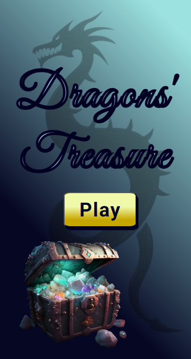 
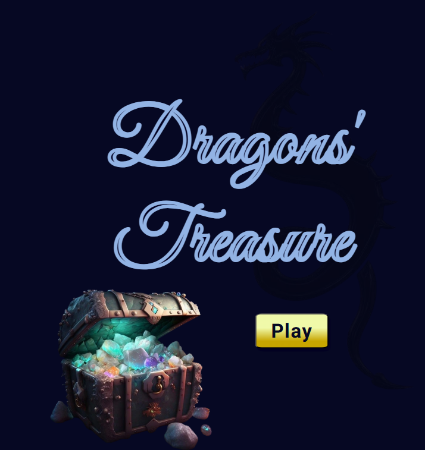
</pre>

For desktop view the page also includes the image of a dragon's head placed on the right bottom corner.

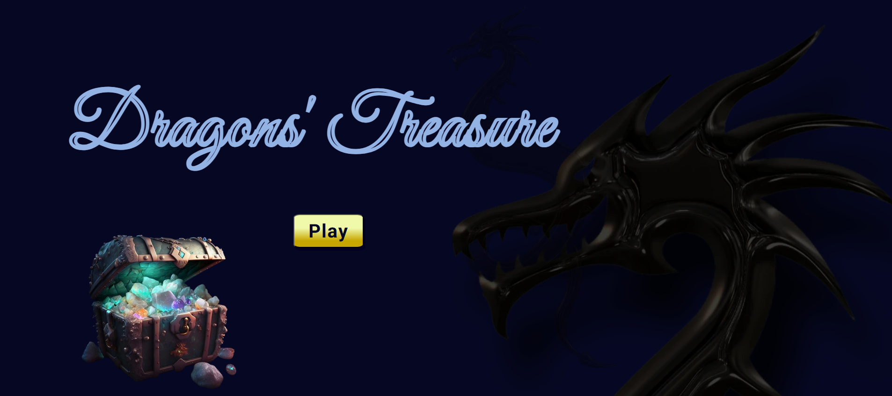

Game.html page has as a background image what I've called the Enchanted Realm:

This is only partly visible in the game and will be fully revealed when winning. On top of this there is a light overlay and the shadow of the dragon centerd, symbolizing a guarded gate to be opened with the right key, the 4 digit key generated by the computer.
<pre>
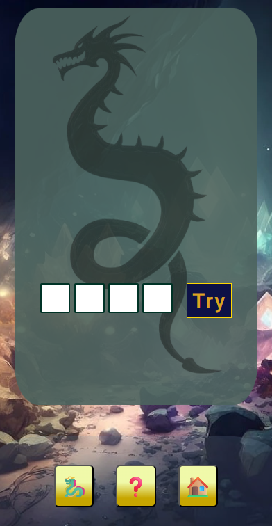  
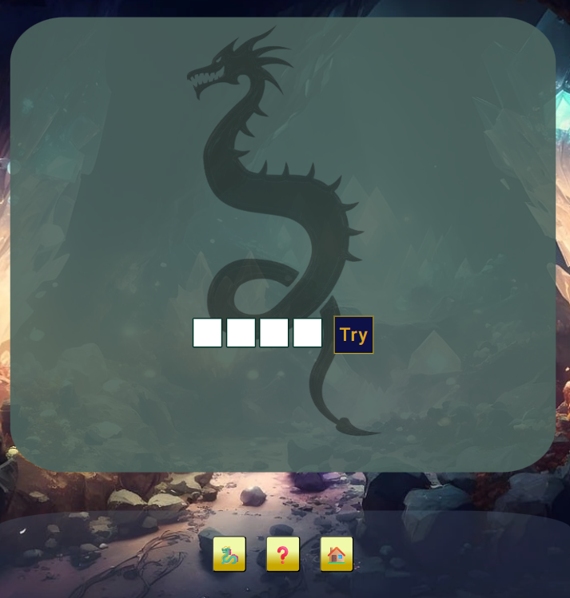
</pre>

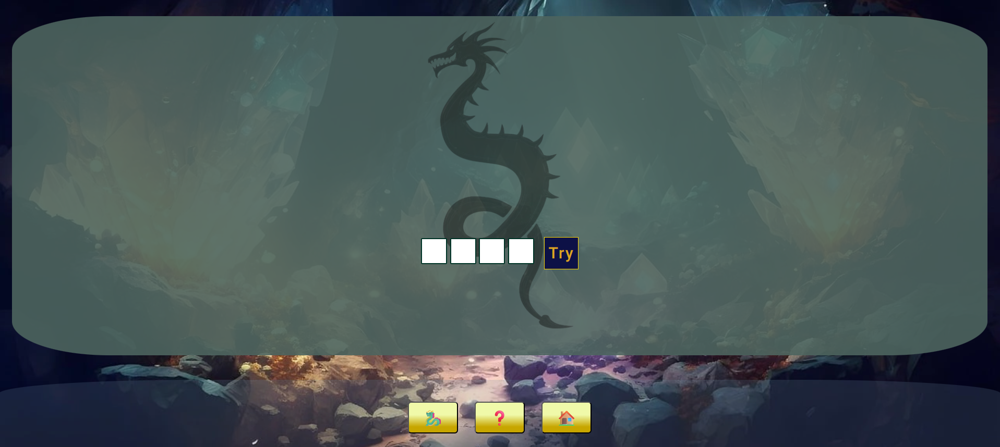

Lower down there are four input fields and a try button to enter and submit player's guess.

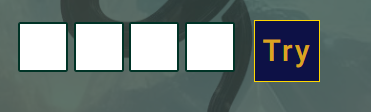

Once the guess is submitted, the 4 digit try and corresponding feedback are displayed in on the gate.

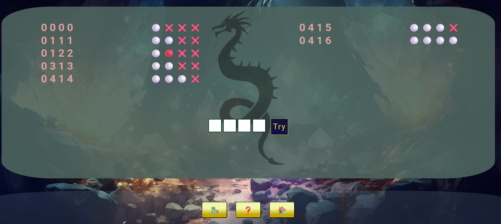

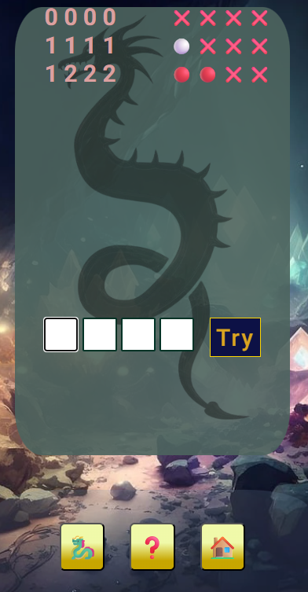

The game page also features 3 user interface buttons. 

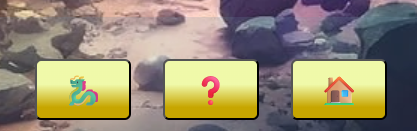

One of them has a dragon symbol and opens a story modal when clicked.

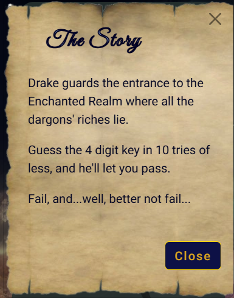

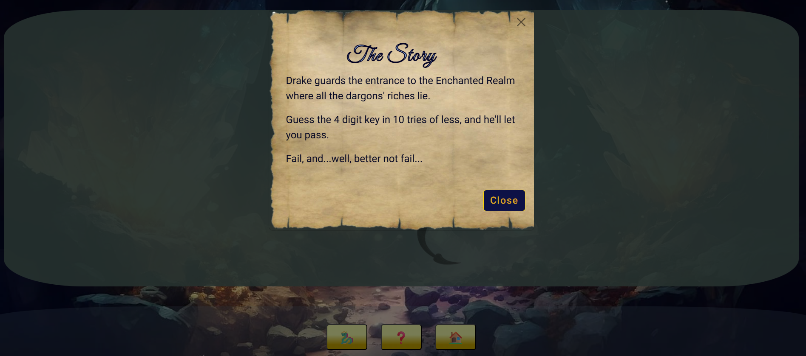

The second one has a question mark symbol and opens an instructions modal.

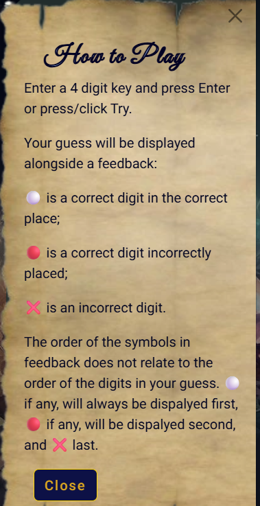

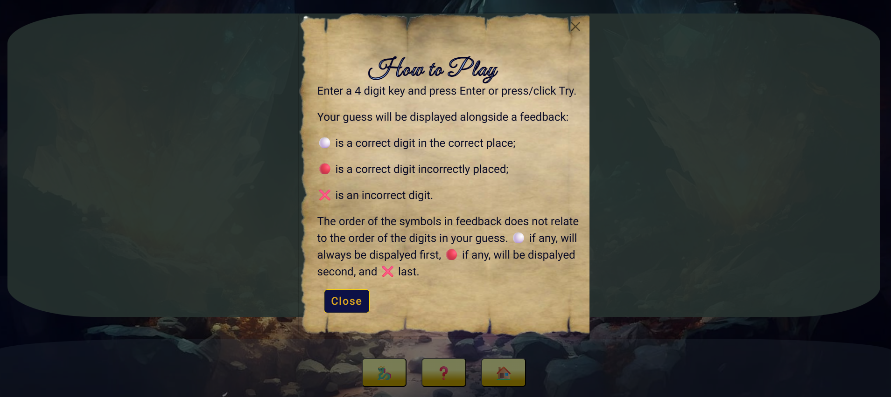

And the third one is a link to home page.

### <h3 id="typography">Typography</h3>
I first experimented with the playful "Mistery Quest" Google Font for heading paired with the contrasting sans-serif "Roboto" for everything else.

In the second phase kept "Roboto" style as a primary font and tried a few fonts for headings like "Skranji" and "Medieval Sharp". In the end I decided to go for "Great Vibes", which I've discovered in Azamat Kashebayev's project, "Magic Forest": https://akashebaev-ux.github.io/Magic-forest/ .

### <h3 id="colours">Colour Scheme</h3>
With the imagery of the final product in mind, for the MVP I chose a colour pallette inspired by dragons and riches: "dragon-green"= #0B870D, "chest-brown"= #46211C, "treasure-gold"= #FFD700, and "contrast-red"= #FF0000 ([see initial pallette here](readme-assets/first-phase/codebreaker-game-pallette.png)).

As there wasn't sufficient contrast between text and background, after checking contrast in Coolors ([see here](readme-assets/first-phase/contrast-check-heading.png)), I updated the colour pallette to:

In the second phase of the game, after trying a few different outlays, I decided to use the background image of the game page as the starting point of my design. I did not have a preset colour scheme. I picked two colours from the enchanted-realm image, var dark-blue and var heading-light-blue. I made a gradient out of the two in coolors.com: 

I used this in the mobile version of the home page, while for the tablet and desktop I used the darker tone only.
The two colours were also combined in home page heading and bootstrap modal headings as text colour and text stroke.
As resource for this I used MDN: https://developer.mozilla.org/en-US/docs/Web/CSS/Reference/Properties/-webkit-text-stroke .

To emphasize the theme of the game, I decided to make another gradient which I've used mainly for buttons, the golden-gradient: 

And again, for the same reason, I chose to combine the button-blue variable with gold and goldenrod tones to create the try button and modal buttons. This combination reminded me of the rich velvet combined with golden threads used in theatre curtains.

This is the general colour pallette used in the final design: 

All other secondary colours used are either a reminiscence of the initial colour scheme, or they were selected ad-hoc in vscode after many tries, for the way they looked and felt, and were possible, validated with lighthouse for accessibility.

### <h3 id="wireframes">Wireframes</h3>
[First phase wireframes](readme-assets/first-phase/first-phase-wireframe.png)

[Second phase wireframes](readme-assets/second-phase/mobiile-wireframe-phase2.png)

## <h2 id="functionality">4. Functionality</h2>
To see the picture of how the basic game would work I designed a [flowchart](readme-assets/first-phase/flowchart.pdf). Then I sketched the basic js [structure](readme-assets/first-phase/js-structure.png).

countTries function https://www.tutorialspoint.com/article/how-to-count-the-number-of-times-a-button-is-clicked-using-javascript#

**Animations**

**Lose Event Animation**
For this event I'm trying to chain 2-3 images to obtain a cinematic animation: 
- dark background covers the game page
- image of a dragon appears and dissapears
- (optional, either here or maybe as a background modal) fullscreen fire image;

So far I've failed to chain these images, having tried with animation-delay. I will now try to start them all at the same time using the following strategy: 
time1 = time for image one animation;
time2 += time1 //nothing happens until time1 has passed
time3 += time2 //nothing happens until time2 has passed

This approach is working.
For wiring up losing text message and UI buttons at the end of the animation I'm planning to use animationend event (resource: https://www.w3schools.com/jsref/event_animationend.asp).

## <h2 id="technologies">5. Technologies Used</h2>
### <h3 id="languages">Languages Used</h3>
HTML has been used to shape the skeleton of the game page.
CSS has been used to style the page.

### <h3 id="frameworks">Frameworks, Libraries & Programs Used</h3>

Git - for version control;

Github - to save and store the files for the game;

Google Fonts - for the fonts used in the game;

https://coolors.co/ for creating the colour pallette;

https://www.freeconvert.com/ for converting images to webp format

https://www.remove.bg/ for removing image background

https://imagecolorpicker.com/ for picking colors from images

https://www.favicon-generator.org/ for generating the favicon used on the site

https://wave.webaim.org/ and lighthouse to test accessibility

## <h2 id="deployment-and-development">6. Deployment and Local Development
### <h3 id="deployment">Deployment</h3>

The live website was deployed using GitHub Pages at: <a href="https://veronicateodorof.github.io/code-breaking-game/">https://veronicateodorof.github.io/code-breaking-game/</a> 

Instructions on how to achieve this can be found below:

1. Log into your GitHub account (or sign up if you don't have one).
2. Go to the repository for this project: <a href="https://github.com/VeronicaTeodorof/code-breaking-game/">https://github.com/VeronicaTeodorof/code-breaking-game</a>.
3. Click on the Settings link on the right hand side of the top navigation bar.
4. In the left hand side navigation bar click on the Pages link.
5. Under the Build and deployment header, in the Source section, select main branch from the dropdown menu. Make sure Root is selected in the dropdown select folder menu.
6. Click Save. The live GitHub Pages website is now deployed at the URL shown.

## <h2 id="testing">7. Testing</h2> 

 ### <h3 id="full-testing">Full Testing</h3>
 After implementing second phase design, my tutor's feedback was that I should keep the submit button everywhere (I intended to remove it completely from the mobile view because of the lack of space); he said that mobile users do not use the enter key on a virtual keyboard much and therefore I needed a dedicated button that I could even align with the form inputs to save space.  He also suggested increasing font size of the feedback and guess on the desktop view and changing some colous in the feedback for better visibility.

 **Instructions**
 I gave the almost finished game to a few friends and family to try. It so happened that none of them had played a Mastermind type of game before, and they all (100%) found the game confusing. Although I had mentioned in the instructions that the order of the symbols in the feedback does not relate to the order of the digits in the guess, they all believed the opposite. After chatting with Claude AI, it pointed to some gaps in my instructions: the missing digit range, not mentioning that repeated digits are allowed, not giving examples. I adjusted my instructions to include the above and I gave the example: secret key 9981, guess key 8881 gives feedback ⚪⚪❌❌, which is for most counterintuitive, 
 but I hope it catches the essence of the game. Now waiting for feedback for the adjusted instructions...

### <h3 id="solved-bugs">Solved Bugs</h3>

**Missallingnment Bug**

After including Bootstrap in game.html page, the text of the guess span was vertically aligned at the base of its container, while the content of the feedback span was centered. This caused a noticeable missalignment between the two. 
I tried to rectify it with bootstrap classes: "allign-middle", "allign-bottom", "allign-text-bottom", "allign-text-top", but none of them had any effect.
I eventually sorted that with css "display: flex;" and "allign-items: center;" with help from https://www.w3schools.com/css/css_align_vertical.asp.

**Wrong Event Modal Bug**

After removing the alerts for winning and losing events, and replacing them with bootstrap modals, Vlad Boitos discovered the event modal bug. The loseModal would always appear on the screen after the player submitted the 10th try, regardless of whether this guess would be worng or correct. When the guess was correct, the loseModal would appear on top of the winModal.

This was corrected by changing the second loosing condition: 

**Interactivity: Pointer Bug**
 Vlad Boitos discovered that input fields still produce visible feedback after win fade-out animation id played, even though they are not visible themselves. I checked and discovered that the now invisible UI buttons also trigger their specific actions when clicked.
 I tried to sort this issue by adding display none to relevant sections when animation ends, using animationend event. This solved the input fields issue (no visible feedback given), but not the buttons. I tried negative positioning relevant sections and tests passed.
 I asked Claude AI if that was a good fix and it sugessted there were better fixes than trying to solve an interactivity problem with a positioning solution, and added that negative positioning can sometimes trigger unexpected scroll or overflow behaviout. It suggested looking up pointer-event css property (good resource: https://mimo.org/glossary/css/pointer-events). This approach works better and sorted the issue.

### <h3 id="known-bugs">Known Bugs</h3>

**The Backspace Bug**

Early in the development process my tutor told me that when a user is required to enter a four digit code, they would expect the cursor to automatically jump to the next input field after the previous one has been filled.
I accomplished that with the following code: 

The problem was that the cursor also moved to the next input in the following situation: the user changes their mind about one of the values entered, manually moves the cursor to one of the previous input fields, presses backspace to delete the value, the value is deleted. Now naturally they expect the cursor to stay in the selected input to be able to type the new value, but instead, the cursor moves to the next input automatically bacause backspace event is interpreted as an "input" event.

I eventually found out how to differentiate betwwen different input event types with inputType Property from: https://www.w3schools.com/jsref/event_inputevent_inputtype.asp and corrected my function as follows: 

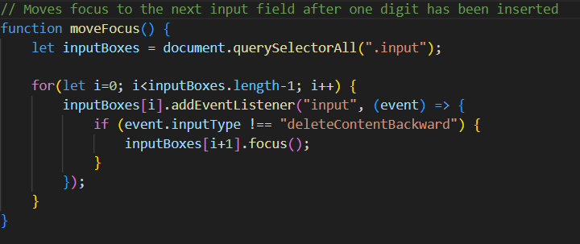

**The Variables Scope Bug**

The current game.js file works, but it's like a house of cards; add anything to it and it tumbles down. The root cause of this is the fact that I wasn't able to access the values of the input fields in js file outside of the showData function, which is the event handler of the submit button and contains the e.preventDefault() method.

To make the game work, I wrote everything needed from that point on inside showData(). I got a warning from my tutor that nested functions are not a good sign, and indeed, close to finishing the project this issue came back to haunt me, as any functionality I want to add only works (if it works), when added inside big, old showData():

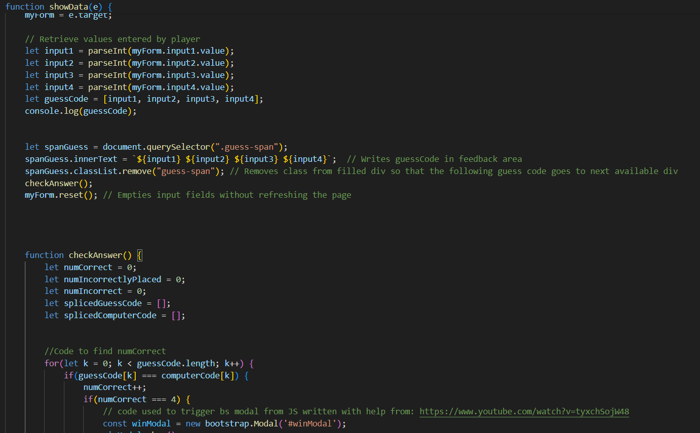

And it doesn't end here.

So I need to rethink and reconstruct that. The latest thing I've tried was to send values from input fields to js into showData(), from here send them back into the DOM in feedback section, and access them again in js from this feedback section outside the above mentioned function. This didn't work either.

I eventually asked Claude AI: "I have a form in html, i want to access the input values in javascript so i have to wite a function to prevent event default and in the same function access the values. How do I then access the values outside of this function?"

This is what I was doing wrong:

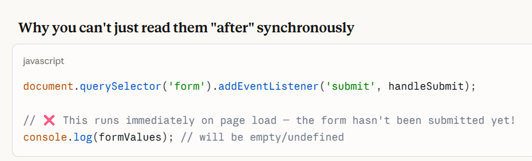

This is what I'll try: 

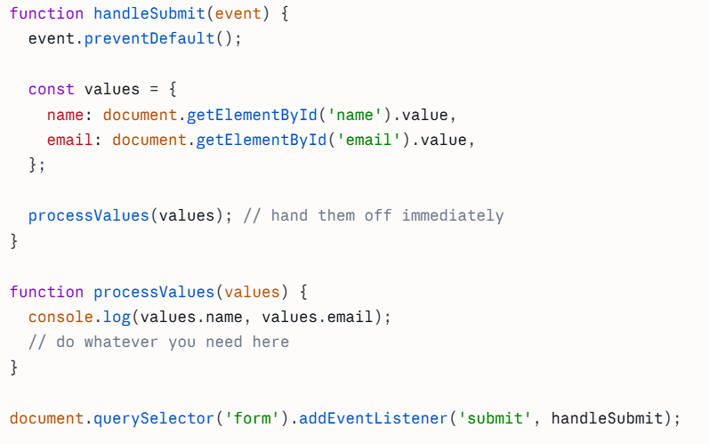.

From my conversation with Claude AI I understood that part of the problem was where the event listener on submit button was called. So I moved it to the bottom of the file.

Then I tried to unnest the functions from inside showData(e) by passing the input values accessed by it and grouped in guessCode array variable, as a parameter to another function checkAnswer(guessCode) and call it from inside showData(e). This way input data travelled down from function to function without the need of having it in the global scope.

But because checkAnswer(guessCode) now depends on data from showData(e), it can't be called in the global scope either. So I decided to use the same technique of passing down data as parameter to a function that would be called from inside the mother function. So I created two more functions that took their parameters form checkAnswer(guessCode): giveFeedback and winLose. Previously, winning and loosing conditions were separate and scatered in different functions, so it felt natural to bring them together into one function.

I created an image with what I understood the logic of the functions chain would be: 

It still feels unnatural that the now separated functions still depend on eachother.

Having asked my tutor about what the initial issue could have been, he sugessted that it could be related to the fact that I was trying to call showData(e) function in the global scope, which throws an error, because e doesn't exist when called directly.

Going back to Claude AI to dig deeper into this I eventually realized where all this came from.
In the section "Getting form data" in Code Institute's course, both runnable examples showed simple submit event handler functions that were also accessing input data; for instance: 
<pre>

 function showData(e) {
        e.preventDefault();
        const formData = e.target;
        const message = document.getElementById("message");
        message.innerText = `First name: ${formData["first-name"].value}. Email address: ${formData.email.value}.`;
 }
</pre>

And I believe most if not all examples I've checked in other sources showed the same thing: a submit event handler that was preventing default behaviiour (page refreshing), declaring form variable and assigning it as the target of the event parameter, and also somehow accessing data from input fields. So my instinct was to copy that. I later realized that I could declare the form variable in the global scope, but still it didn't cross my mind that I could also access the values of the input fields in functions other than showData(e).

So now I'll try this: showData(e) will only prevent event default, and call another function that accesses the input values. Nothing else.

### <h3 id="w3c">W3C Validation</h3>

**First phase:**
Initial validation of the HTML boilerplate shows two errors: [initial HTML boilerplate validation](readme-assets/first-phase/W3C-initial-test-HTMLboilerplate.png). The errors have been corrected and the HTML boilerplate has been validated: [validation of HTML boilerplate](readme-assets/first-phase/html-boilerplate-validated.png).
After adding basic CSS styles and changing HTML accordingly, I tried to validate again. One error was showing: [HTML page validation after adding css](readme-assets/first-phase/html-after-css-initial-validation.png). The error has been corrected.
Style.css page has also been validated with no errors found: [css initial validation](readme-assets/first-phase/css-initial-validation.png).

**Second phase:**
Index.html page was successfully validated with no errors or warnings to show:
[Index Page HTML](readme-assets/second-phase/index-page-validation)

### <h3 id="lighthouse">Lighthouse</h3>
Initial lighthouse tests show some areas that can be improved in terms of accessibility and SEO. Here are the screenshots for initial tests: [initial lighthouse for mobile](readme-assets/first-phase/lighthouse-for-mobile-initial.png), [initial lighthouse for desktop](readme-assets/first-phase/lighthouse-for-desktop-initial.png), [accessibility](readme-assets/first-phase/accessibility-initial.png) and [SEO](readme-assets/first-phase/seo-initial.png).

During second phase development lifecycle lighthouse tests revealed some accessibility issues related to the size of UI Buttons:
[second-phase initial test](readme-assets/second-phase/lighthouse-2nd-initial1.png),
[initial accessibility issue](readme-assets/second-phase/lighthouse-2nd-initial2.png).

After changing button size and margin, the accessibility issue was solved:
[mobile lighthouse after](readme-assets/second-phase/mobile-lighthouse-after.png), 
[desktop lighthouse after](readme-assets/second-phase/desktop-lighthouse-after.png).

### <h3 id="accessibility">Accessibility</h3>
-<main> was added to 404.html as sugessted by lighthouse;
- headers were added to win and lose modals as suggested by https://wave.webaim.org/;
- legend was added to fieldset and labels to inputs as suggested by lighthouse and https://wave.webaim.org/, with "visually-hidden" bootstrap class, so that they are only visible to screen readers.

## <h2 id="credits2">8. Credits</h2>
### <h3 id = "resources">Resources</h2>
**Bootstrap Modals**
https://www.w3schools.com/bootstrap/bootstrap_ref_js_modal.asp

**JavaScript**
https://developer.mozilla.org/
https://developer.mozilla.org/en-US/docs/MDN/Writing_guidelines/Code_style_guide/JavaScript for JS Best Practices

### <h3 id="documentation">Documentation</h3>

While trying to understand what intuitive design for a game means, and what the acceptance criteria and tasks whould be in order to meet this user story, I realized that I need to add another user story, the one about input validation, because no player wants to be allowed to enter invalid data type, but they want to be warned about that, and easily correct the mistake. So this user story is written with the help of AI overview for "acceptance criteria for intuitive design of a game".

### <h3 id="media">Media</h3>

background image - Georgiana Romanovna (GeorgyGirl) on Pixabay
dragon sleeping - Annette (pendleburyannette) on Pixabay